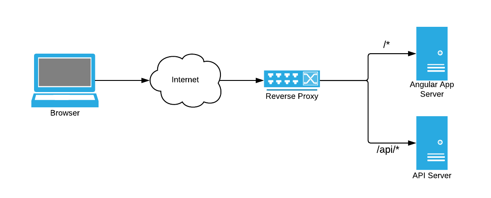

# Good Practices for Configuring your Angular App

In this post I'm going to talk about some of the best ways to get your configurations to your Angular app. Just note, this isn't a post about Angular framework level configurations, this about how the features you're developing receive your configurable values.

## Where's my Backend API Server?

Most SPAs need a backend API server, so when development starts there's the question of "how do I tell my app where my API server is?" The answer is that you don't. Your app should assume the API server is served from the same host as the app itself. It will only use relative URLs (in this case "relative" means no protocol, host, or port specified) to call the API server.

For example:
```typescript
@Injectable({
  providedIn: 'root'
})
export class ServerTimeService {

  constructor(private httpClient: HttpClient) { }

  getTime(): Observable<string> {

    // Calls relative path `/api`. No host in the URL here.
    return this.httpClient.get('/api/servertime')
      .pipe(map((data: any) => data.servertime));
  }
}
```

This is nice and clean, and avoids [CORS](https://developer.mozilla.org/en-US/docs/Web/HTTP/CORS) complications and issues.

How do we achieve this? With [Reverse Proxies](https://www.nginx.com/resources/glossary/reverse-proxy-server/).

Let's look at the scenario where your backend API server sits at `http://myinternalhost:8080/api` and we want the app to be able to make requests only to paths starting with `/api`. Here's how you can configure reverse proxies for development and when deployed:

### Proxy Server during Development

When a project is generated using Angular CLI it uses [webpack](https://webpack.js.org/) (at least at the time of writing this) which includes a [dev server](https://webpack.js.org/configuration/dev-server/) that hosts the app and watches for changes when we run `ng serve` (or `npm start` if you're using the Angular CLI defaults). This server also includes a reverse proxy which can be configured via `proxy.conf.js` or `proxy.conf.json` file. You can read more about it in the [Angular CLI repo](https://github.com/angular/angular-cli/blob/master/docs/documentation/stories/proxy.md). I prefer the 'js' version of the file since it gives us more flexibility.

Given our example scenario for getting requests from the relative path `/api` to the absolute path `http://myinternalhost:8080/api`, we can setup our `proxy.conf.js` in the root of out project folder like so:

```javascript
const PROXY_CONFIG = {
  '/api': {
    'target': 'http://myinternalhost:8080',
    'secure': false,
    'logLevel': 'debug',
    'changeOrigin': true
  }
};

module.exports = PROXY_CONFIG;
```

And alter the "start" npm script to tell it to use the `proxy.conf.js` file:

```json
"start":"ng serve --proxy-config proxy.conf.js"
```

Of course it would be better if the `target` value was not hardcoded to a specific server in a file that we're going to be checking into version control, so we can use an environment variable instead. Let's make the above snippet better:

```javascript
const PROXY_CONFIG = {
  '/api': {
    'target': process.env.API_SERVER,
    'secure': false,
    'logLevel': 'debug',
    'changeOrigin': true
  }
};

module.exports = PROXY_CONFIG;
```

The environment variable can be passed via commandline `API_SERVER=http://myinternalhost:8080 npm start`.

### Reverse Proxy when Deployed

When you're deploying your application, you won't have webpack's dev-server to use as a reverse proxy so you'll need a separate standalone one. Popular options for reverse proxies are webservers like [NGINX](https://www.nginx.com/) or [Apache HTTP Server](https://httpd.apache.org/). These serve other purposes as well such as handling HTTPS, load balancing, or if you're not using Server Side Rendering (https://angular.io/guide/universal) they can be used to serve your Angular app's static assets. So it's likely you'll need one of these anyways.

The key idea here is that the reverse proxy is the single point for traffic to and from the browser for both requests to your app, and requests to the API server.



Here's a snippet of nginx configuration that forwards traffic to your app, and to our `http://myinternalhost:8080` API server:

```nginx
server {
  listen       80;
  server_name  localhost;

  # Reverse proxy all traffic to the Angular app
  location / {
    proxy_pass http://localhost:4000;
  }

  # Reverse proxy all traffic starting with `/api` to the backend API server
  location /api {
    proxy_pass http://myinternalhost:8080;
  }
}
```

NGINX itself can be configured to use environment variables as mentioned on its [Docker Hub page](https://hub.docker.com/_/nginx).

### What about Server Side Rendering?

In server side rendering (SSR), your Angular app's code is running on the server similar to how it would run in the browser, complete with the API calls it needs to make but with a few exceptions. One of those exceptions is that relative URLs are meaningless on the server. Servers want absolute URLs. So it turns out that our app *does* need that absolute URL to the backend API afterall.

Luckily, when rendering on the server, we're *not* in a context where we need to worry about CORS, and we *are* in a context where your code can read environment variables. So our example HttpClient request can be altered to look like this:

```typescript
@Injectable({
  providedIn: 'root'
})
export class ServerTimeService {

  constructor(private httpClient: HttpClient, @Inject(PLATFORM_ID) private platformId) { }

  getTime(): Observable<string> {

    const path = '/api/servertime';

    // Make URL absolute only if on the server
    const url = isPlatformServer(this.platformId) ? process.env.API_SERVER + path : path;

    return this.httpClient.get(url)
      .pipe(map((data: any) => data.servertime));
  }
}
```

This doesn't mean we can ditch the reverse proxy setup, we still need that when the app is running in the browser. This is just an extra consideration to make when leveraging SSR.

**Note:**
For this to compile, you will also need to install node types via `npm i -D @types/node` and then add `"node"` to the `compilerOptions.types` array of the the `tsconfig.app.json` file.

## Environment Variables vs Environment.ts

Let's imagine another scenario where your Angular app has a typeahead search in it, and it needs a debounce time to decide when the user has stopped typing and it's safe to make an API call. Kind of like [this article](https://www.freakyjolly.com/angular-7-6-add-debounce-time-using-rxjs-6-x-x-to-optimize-search-input-for-api-results-from-server/) describes. We want to make the debounce time configurable.

It'd be tempting to use the `Environment.ts` and `Environment.prod.ts` as the configuration point for this debounce time, but you probably shouldn't. Actually, just don't. It's a violation of the [third factor](https://12factor.net/config) of [The Twelve-Factor App](https://12factor.net/). The short of it is that if you are using a version controlled file in your app to store configuration then your app has to be rebuilt and redeployed just to affect a configuration change. Sounds like hardcoding not configuration. This is fine for the world of Infrastructure as Code and GitOps but it is not ideal for applications.

In general you probably won't use the `Environment.ts` files much unless there are different modes your application needs to be built in. If you find yourself writing `Environment.staging.ts` or `Environment.qa.ts` files, you're doing it wrong.

So how do you configure this 'debounce' time in the app? With Environment Variables! How do we use environment variables in an app that mostly runs in the browser? Serve them via API server.

There are multiple ways to do this. We'll take the approach that we're using a purpose built "Config" REST endpoint just for this Angular app.

### Sending environment variables during Development

A quick and easy way to create a Config REST endpoint to use during development is to leverage the webpack's proxy server. We can create a faux backend inside the `proxy.conf.js` file like so:

```javascript
const PROXY_CONFIG = {
    '/config': {
        'bypass': function (req, res, proxyOptions) {
            switch (req.url) {
                case '/config':

                // Send an map of config values
                res.end(JSON.stringify({
                    DEBOUNCE_TIME: process.env.DEBOUNCE_TIME || 500 // Read from environment or default to 500
                    ... // Other config values here
                }));
                return true;
            }
        }
    }
    ... // Other proxy settings
};

export PROXY_CONFIG;
```

From there it's just a matter of making a call to this `/config` endpoint just like any other endpoint.

```typescript
this.httpClient.get('/config');
```

You can start your development server with an environment variable like so `DEBOUNCE_TIME=300 npm start`

### Sending environment variables when Deployed

For this, you'd probably just have to build a separate server, perhaps using something like [Express](https://expressjs.com/). However, if you're leveraging server side rendering then you'll probably already have a server in the form of the `server.ts` file (likely generated by a [schematic](https://angular.io/guide/schematics) like [@nguniversal/express-engine](https://www.npmjs.com/package/@nguniversal/express-engine)). This is a good place to add a little extra functionality to serve up configuration read from server side environment variables in a similar manner to how it's done in the `proxy.conf.js` example.

Add the following to the `server.ts` file used for SSR:

```javascript
app.get('/config', (req, res) => {
  res.status(200).send({
    DEBOUNCE_TIME: process.env.DEBOUNCE_TIME || 500 // Read from environment or default to 500
    ... // Other config values here
  });
});
```

During server side rendering, when the code is executing on the server you won't necessarily need to call this API (though you could) since you can just directly access the environment variables from within code. To keep things simple, it's probably best to hide how all of your configuration values are retreived behind a single "Config" Angular service:

```typescript
@Injectable({
  providedIn: 'root'
})
export class ConfigService {

  constructor(private httpClient: HttpClient, @Inject(PLATFORM_ID) private platformId) {}

  getConfig(): Observable<any> {

    // Direct, speedy access to environment variables when on server.
    if (isPlatformServer(this.platformId)) {
      return of({
        DEBOUNCE_TIME: process.env.DEBOUNCE_TIME
      });
    }

    // Otherwise from the brwoser call the `/config` API.
    return this.httpClient.get('/config');
  }
}
```

#### Avoid Depending on Transferstate to Transport your Configuration

When using server side rendering, It may be tempting to avoid setting up a "Config" REST service like the one above and just leverage transfer state to gather values from environment variables on the server and send them to the client. This may or may not work for you but if you're enabling [Progressive Web App](https://angular.io/guide/service-worker-getting-started) then a good deal of the time server side rendering won't even come into play since the app is rendered from javascript and other assets cached in the browser, bypassing SSR completely. Since there's no SSR happening in a PWA, there's no transferstate, so it's not a good idea to make it the sole medium for transporting configuration values.

## The right time to call your Configuration API endpoint

There are different situations where you may need to call a configuration API in the lifecycle of your app. The earlier it's called the better, but it can also get more complex. These are some of the places where you could call the config API from:

### On Demand, maybe leveraging a behaviour subject

This is like the title says, call it only when you need. This is ideal when you require configuration values for some of the views or components you're developing. You can call the config API from one of the [lifecycle hooks](https://angular.io/guide/lifecycle-hooks) of your components.

Perhaps use something like a [Replay Subject](https://rxjs-dev.firebaseapp.com/api/index/class/ReplaySubject) to prevent multiple or competing calls going to the config API at once and to cache your config values.

### From the Angular APP_INITIALIZER hook

An APP_INITIALIZER function gets called during Angular's startup. This is likely the place you want to execute your config retrieval if some of those configurations are central to the app. Like say, if they relate to how you might configure a global aspect of the app such as internationalization, or possibly affect some change in routing, or maybe if you prefer the app to just fail fast when there is an invalid configuration instead of finding out later when the config value is finally used.

You can read more about the [APP_INITIALIZER](https://www.tektutorialshub.com/angular/angular-how-to-use-app-initializer/).

Again, it's probably good to wrap the config API call in a Replay Subject just so that its results can be cached for later.

### Before Angular Starts

This is the earliest time to retrieve configuration: before anything Angular begins to bootstrap. This is good for situations where you need these values even early than APP_INITIALIZER allows. Examples might be if you need them to configure a custom [HttpInterceptor](https://angular.io/api/common/http/HttpInterceptor) or if you have a special [Error Handler](https://angular.io/api/core/ErrorHandler) that needs an API key to a logging service.

The place to make this call is in the `main.ts` file. On return, store the results in local storage so that they can be retrieved when needed. Note that angular service such as HttpClient won't be available so the browser basics like `fetch` or `XMLHttpRequest` will have to do.

Example `main.ts` file:
```typescript
if (environment.production) {
  enableProdMode();
}

document.addEventListener('DOMContentLoaded', async () => {

  const response = await fetch('/config');
  if (response.status === 200) {
    const result = await response.text();
    localStorage.setItem('config', result);
    platformBrowserDynamic().bootstrapModule(AppModule)
    .catch(err => console.error(err));
  }
});
```

## .env Files

One last bonus tidbit of information: It can be tedious to setup environment variables in the command line when developing. Especially if there's a lot of them. The answer to this problem is the `.env` file.

It's a simple file where each line is an environment variable assignment in the format `VARIABLE_NAME=value`. *And* it supports comments!

The `.env` file works out of the box in some runtimes, like for docker-compose, but doesn't work out of the box in node.js. You'll need to install the library [dotenv](https://www.npmjs.com/package/dotenv) as a dev dependency: `npm i -D dotenv` and then have it loaded up.

To load it in your `proxy.conf.js`, just add the following line to the top of the file.
```javascript
require('dotenv').config();
```

To load it for SSR, alter the npm script called "serve:ssr" to the following:
```json
"serve:ssr":"node -r dotenv/config dist/server"
```

Finally be sure `.env` file entry is added to your `.gitignore` file. This file is for your local development, it would be really annoying if your settings were regularly and unexpectedly clobbered by someone else's changes whenever you're pulling the latest.

## Wrapping up

To summarize what we've learned here about getting configuration to your Angular app:

1. Use a reverse-proxy to "host" your Angular app and Backend APIs from the same server, don't try to configure where that backend API is in your Angular app.

1. You may have very frontend specific configurations that aren't appropriate to serve from your existing business oriented backend APIs. If so, create a simple config API by hijacking your webpack dev-server during development, and by hijacking your server.ts file if your're using SSR.

1. Environment Variables are a good medium to set config values from the server side.

1. You probably won't need `Environment.ts` files as much as you think.

1. There are various times to call your config API. Pick one.

1. Don't forget the `.env` files

Hope this was a good read. Not all of it will be appropriate for your project, but I'm sure some of it will be.

Sample project source, and this blog in the works, can be found [here](https://github.com/PaulDMooney/angular-config-blog)